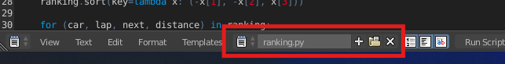
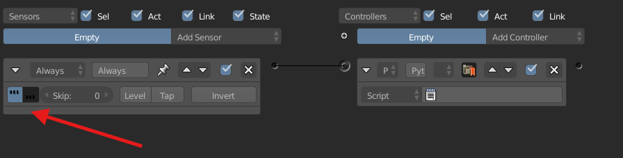
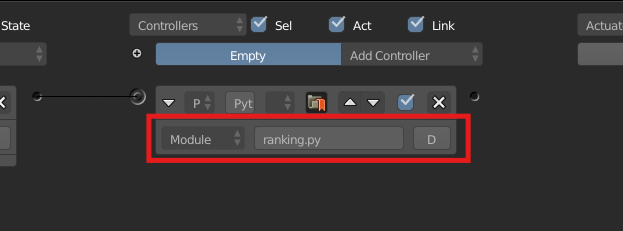
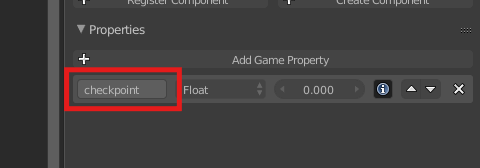
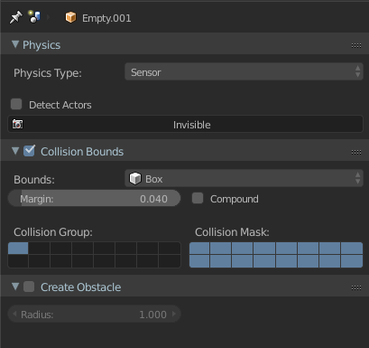
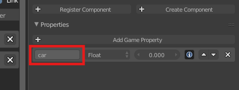
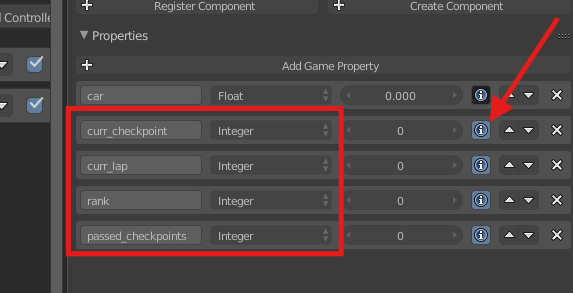

# UPBGE Racing Ranking System

A simple but functional positioning system for racing games.

Keep tracking of laps, checkpoints passed and the cars position in the ranking through checkpoints placed on the track.

## Table of contents

- [How to Configure the Script](#configure-the-script)
- [How to Configure the Checkpoints](#configure-the-checkpoints)
- [How to Configure the Cars](#configure-the-cars)

## Configure the script

1.  Paste the script in the Text Editor then save it as ranking.py

    

2.  Add a empty object to the scene, then add a Python controller to it.
    Link the Python Controller with an "Always" sensor and activate the True triggering:

        

3.  In the python controller with module mode, enter "ranking.main".

    

## Configure the checkpoints

Add a Game Property "checkpoint" to each checkpoint object.

I recommend adding the chekpoints from track start to end, because the chekcpoints need to be ordered by name. The first checkpoint needs to be placed in the start line.

PS: If you are using an empty as checkpoint, make sure to configure the Physics type to "Sensor" and activate "Collision Bounds".

## Configure the cars

Add a Game Property "car" to each car object.

If you want to see the ranking properties, add the following Game Properties and activate the "debug button":

PS: these game properties need to be added just for Debuging Purposes.
